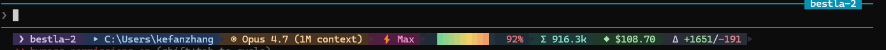

# Claude Code Statusline — Pills Edition

A polished, pill-style status line for [Claude Code](https://claude.com/claude-code).



Shows: session name · CWD · git branch · model · effort level · context bar · tokens · cost · lines changed. Segments auto-hide when empty.

## Install

**Windows (PowerShell):**

```powershell
irm https://raw.githubusercontent.com/yinshanlake/claude-statusline-pills/main/install.ps1 | iex
```

**macOS / Linux / Git Bash:**

```bash
curl -fsSL https://raw.githubusercontent.com/yinshanlake/claude-statusline-pills/main/install.sh | bash
```

Open a new Claude Code session to see it.

## Requirements

- `bash`, `jq`, `awk` on PATH (Windows: install [Git for Windows](https://git-scm.com/download/win) + `winget install jqlang.jq`)
- Terminal with 24-bit true color (Windows Terminal, iTerm2, Alacritty, WezTerm, etc.)

## License

MIT
